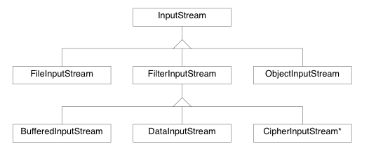
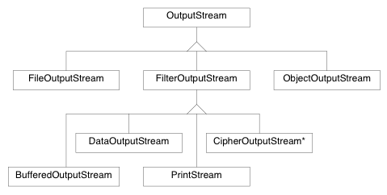

### **General summary of course EDA095** ###
 by Johan Davidsson

----------
###**Streams:** I/O in Java
* Read  from an **input stream**, write to an **output stream**

####**Input**



**Read ten bytes**
```java
byte[] input = new byte[10];
for (int i = 0; i < input.length; i++) {
	int b = inputStream.read();
	if (byte == -1) break; 
    	input[i] = (byte) b;
}
```
**or just**
```java
byte[] input = new byte[10]; 
int r = inputStream.read(input);
//.read(byte[]) returns number of bytes read
```

####**Output**



* **Buffers** increases effectiviness but don't forget to **flush() !**


```java
OutputStream os = ...
PrintWriter out = new PrintWriter(os,true);
//true means autoflushing
out.write("nicely flushed!");

```


----------
###**Threads:** do things in parallel

* ***Busy-wait:*** thread consumes available CPU-time while waiting.

 * **Deadlocks** 
 
 ```
threads x,y  wants access to objects A,B
x gets A first
Y gets B first
now both x ,y stuck waiting 

 ```

#### **Threads in java**
* Both class **Thread** and interface **Runnable** implements/overrides the **run()** method.

* Start Thread: 


```java
MyThread mt = new MyThread();
mt.start(); 
```
	
***or***


```java
Runnable r = ...
new Thread(r).start();
```

#### **Synchronization and Monitors**

```java
synchronized void synchMe() { ... }
```

* The thread running the *synchronized* method **owns** it. 
*  Therefore other Threads that want to run `synchMe()`are in the **blocked state**

`wait()` `notify()` `notifyAll()` are useful if the **Monitor**-object isn't ready for action.

**A monitor class:**
```java
public synchronized int getNumber() {
	if (numbers.empty()) wait();
	return numbers.pop();
}
public synchronized void addNumber(int number) {
	numbers.push(number);
	notifyAll();
}
```

 - `notify()`awakens **one** arbitrary thread that's waiting
 - `notifyAll()`awekens **all** waiting threads


----------


###**Socket** TCP connection (Java)

> A socket is one end-point of a two-way communication link between two programs running on the network. 

* Client  > **Socket** `getInputStream // getOutputStream`

```java
try { 
	Socket socket = new Socket(host,port);
	PrintWriter out = new PrintWriter(socket.getOutputStream(), true);
	BufferedReader in = new BufferedReader(new InputStreamReader(socket.getInputStream()));
	
	//do things with I/O
	String received = in.readLine());
	out.println("I want fish!");

	} catch (fish) { eat(); }
	
```

* Server  > **ServerSocket** `accept()` `close()`

**ServerSocket** with thread pool using **Executors** 
```java
ServerSocket ss = new ServerSocket();
ExecutorService pool = Executors.newFixedThreadPool(5);
while (wantSocket) {
	Socket socket = ss.accept();
	pool.submit(new MyThread(socket));
}
//MyThread does things with socket

```

----------


###**Datagram** UDP connection (Java)

* Datagrams can be sent with UDP with Java classes:

	* **DatagramPacket**  (represents the packet)
	* **DatagramSocket** retrives/sends packets

***Code that receives/send packets*** 
```java
import burgers;
import imagine.exception.handling;

DatagramSocket ds = new DatagramSocket(port);
byte[] buf = new byte[65536];
DatagramPacket packet = new DataGramPacket(but, buf.length);

ds.receive(packet); //fill em up
String message = new String(dp.getData(), 0, dp.getLength());
String reply = "What are you talking about?";
switch (message) {
	case "burger":
		reply = "where´s the extra cheese?";
	case "burger with extra cheese":
		reply = "thanks";
}
byte[] b = reply.getBytes();
DatagramPacket replyPacket = new DatagramPacket(b,b.length,address,port);
ds.send(replyPacket); 
```


#### **Multicast:** Send *one copy* to many receivers 

* **TTL** *(time to live)* **:** prevents packet from circulating the web foreeeeever. When the counter hits 0 the packet dies. Useful in **Multicasting**

* Java uses **MulticastSocket**
*  `joinGroup(inetAddress)` is used to subscribe (receive) 

```java
MulticastSocket ms = new MulticastSocket();
ms.setTimeToLive(2);
InetAddres address = InetAddress.getByName("some.multicast.url");
DatagramPacket packet = new Da.....
// lines creating packet 
ms.send(packet);
```


----------


###**URL/URI:** 

* **URI** *(Uniform Resource Identifier)* **:** reference to a resource (subsumes URL)

* **URL** *(Uniform Resource Locator)* **:** reference to web resource
	* **URL** is the most common form of an ***URI***

creating a **URL** with Java:
```java
 URL baseURL = new URL("http://www.base.com");
 URL myUrl = new URL(baseURL,"relative.html");
```
download URL content to file
```java
import patience;

File file = new File("Target");
InputStream in = myUrl.openStream();
FileOuptutStream fos = new FileOutputStream(file);

while((bytesRead = in.read(buf)) != -1) {
	fos.write(buf,0, bytesRead);
}
fos.close(); in.close(); //coffee break
```


----------


###**HTTP** *(Hypertext Transfer Protocol)* **:** 
* **GET** *requests data from specified resource (URI)*
	*  `foo.se?name1=value1&name2=value2` query in URL
* **POST** *submits data to be processed to a specified resource*
  * `foo.se` query in "message body" of POST
  
* PUT *stores the resource*
* HEAD *like GET but returns headers*
* DELETE *deletes resource*
* and OPTION,TRACE,CONNECT...


----------


###**XML** *(eXtensible Markup Language)* **:**  markup

* **DOM** *(Document Object Modell)* **:** builds tree of XML
* **SAX** *(Simple API for XML)* **:** event-oriented XML-parser

Both DOM & SAX are XML-parsers. The difference is that DOM builds a tree representing the *(whole)* XML document whilst SAX parses "tag by tag". This makes SAX faster than DOM although DOM is more usable to analyze/transform and recommended by W3C.

* **XSL** *(eXtensible Stylesheet Language)* **:** like CSS for XML kinda
* **XSLT** *(XSL Transformations)* **:** used for transformations on XML documents. For instance XML to HTML.
* **XPath** **:** names and accesses nodes. Used by **XSLT**.


----------


###**Other words/concepts**


* **MIME-type:** two-part identifier for file formats
	* `text/html; charset=UTF-8`
	* text is the type, html is the subtype and chars... is the parameter.


* **Unicode:** giant collection of characters with correlating "code". A family of encoders implements it.  
* **UTF-8:** implements Unicode so that each character gets one (or more) byte(s).


####**JSP & Servlets**####

* **JSP** *(Java Server Pages)* **:** code runs on server *in* HTML (compare **PHP**)
*  **Servlet:** code runs on server 

> " JSP is a webpage scripting language that can generate dynamic content while Servlets are Java programs that are already compiled which also creates dynamic web content. Servlets run faster compared to JSP. JSP can be compiled into Java Servlets. It's easier to code in JSP than in Java Servlets. " 
> http://stackoverflow.com/questions/4965914/java-jsp-vs-servlet

----------


* **Codec:** program that encodes/decodes data stream e.g video

*  **RTP (Real Time Transport Protocol):** network protocol for delivering audio/video over IP e.g *VoIP*
*  **RTSP (Real-Time Control Protocol):** provides statistics/control info for an RTP session
*  **SIP (Session Initiation Protocol)**: communication protocol with similar operations as HTTP. Used with **RTP** and **RTSP**

* **RMI (Remote Method Invocation) :** Communicate Java-objects over network. The process of converting object parameters/returns to a Serializable format appropriate for sending is called ***Marshaling***. A **Registry** is a separate server program that helps **RMI-servers** and **RMI-clients** to connect.


----------

###**Not covered:**

 - **java.nio** multiple TCP-connections on one thread without *busy-wait* (Selector)
 - **REST** *( - architecure)* **:** 

----------


###**Notes:**

 - Remember, exceptions are thrown everywhere in the code
 - In real life you have to **Catch 'em all**
 * No guarantee of truth
