# Instuderingsfrågor 2017

_Författare:_
    
Emil Hammarström

Adam Thuvesen

Pontus Ovhagen

`Koffeindonationer uppskattas.`

## Processorn

1. __Vad är Moores lag?__
    
    Observation av att antalet transistorer dubblas varje år.

    __Vad är Murphys lag?__

    _"Om något kan gå fel kommer det förr eller senare att göra det"_
    
    Lycka till på tentan.

2. __Vem är von Neumann?__

    Pionjär inom mängdlära, spelteori, kvantfysik och datavetenskap.
    Grundare till von Neumann-arkitekturen som har använts sedan 1940-talet.

3. __Vad gör en kompilator?__

    Transformerar källkod till ett annat datorspråk.
    Detta kan vara maskinkod, eller ett mellanspråk.

4. __Vad gör en assemblator?__

    Översätter assembler till maskinkod.

5. __Ge exempel på ett högnivåspråk?__

    Java

6. __Vad skiljer ett högnivåspråk från ett maskinspråk?__

    Maskinspråk är binärkod som procerssorn direkt kan tolka.
    Högnivåspråk kan ej tolkas av processorn och har en hög abstraktionsnivå.

7. __Görs alla beräkningar (ADD, SUB, ..., AND, OR) i ALU:n?__

    Alla integer beräkningar görs av ALU:n, men till flyttal
    används en FPU (Floating-point-unit).

8. __Ge exmpel på indata och utdata till en kontrollenhet.__

    In- och utdata för ALU och Kontrollenhet

        Kontrollenhet
        Indata:
        00001   01110001    011
        MOVE    ADDRESS     REGISTER
        Utdata: "Säga till processorn vilken operation och vilka register som skall användas"

        ALU
        Indata:
        IN1, IN2, + Eventuella statussignaler
        Utdata:
        UT, + Eventuella statussignaler

9. __Ge exempel på fördelar med att använda register för att lagra data.__

    Accesstiden för registerlagring är flera potenser snabbare.
    Access av data i processorregister förväntas ta få antal ns, 
    L1 tar ~10ns, L2 10-tal ns, RAM ~100ns (Primärminne), HDD 10-tal ms (Sekundärminne).

10. __Om en processor gör _fetch_ och _execute_, vad gör under _fetch_? Vad görs under _execute_? Är det som görs under _fetch_ samma för alla instruktioner?__

    Under Fetch hämtas instruktion där PC pekar och flyttar instruktionen till CPU:n 
    där kontrollenheten avkodar instruktionen, under execute hämtas datan och operationen 
    görs för att sedan lagra detta i ett register. Ja, 100%.

11. __Ge exempel på system där man hittar datorer.__

    Apollos vägledningsdator. Industrisammanhang. Algoritmisk börshandel. Dammportar.

12. __Vad finns det för olika typer av datorer?__

    Smartphone, bärbar dator, persondator, superdator, minidator, servrar?

13. __Var kan man hitta processorer?__

    Överallt! Microprocessorer överallt, miniräknare, programmerbara styrsystem osv.

14. __Vad kännetecknar ett minne som är _volatile_?__

    Flyktigt minne, RAM, återställs/töms när strömtillförseln stryps.

15. __Ge exempel på minnen som är _volatile_.__

    RAM (Primärminne) och Processorregister

16. __Vad kännetecknar ett minne som är _non-volatile_?__

    Minne som kvarstår, bevaras och kan förflyttas fysiskt utan systemkoppling.

17. __Ge exempel på minnen som är _non-volatile_.__

    HDD (Sekundärminne) roterande skivor med magnetisk beläggning.

18. __Vid IC tillverkning, vad gör en dicer?__

    Skär ut rektangulära chip-skivor ur de stora runda siliconskivorna.

19. __Vem grundade Intel?__

    Gordon E. Moore och Robert Noyce

    __Vem grundade AMD?__

    Jerry Sanders III och Edwin Turney

20. __Vad är Moores lag?__

    Se svar till fråga 1.

21. __Vad består en von Neumann-arkitektur av?__

    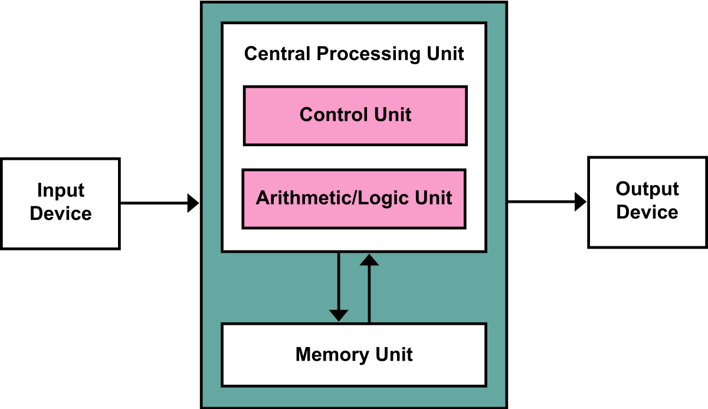

22. __Vad används en kompilator till?__

    Se svar till fråga 3.

23. __Vad är skillnaden mellan ett högnivåspråk och maskinkod?__

    Se svar till fråga 6.

24. __Ge exempel på högnivåspråk.__

    Se svar till fråga 5.

25. __Vad händer under _fetch_ fasen?__

    1. Vi hämtar instruktionen där PC pekar
    2. Vi flyttar instruktionen till CPU:n
    3. Kontrollenheten avkodar instruktionen till operationer 
    som processorn skall göra med specifierade register.

26. __Vad händer under _execute_ fasen?__

    1. Vi exekverar den operation som Fetch gav oss.
    Detta kan vara att hämta data eller göra en beräkning.
    2. Vi lagrar datan i det register eller på den minnesplats Fetch gav oss.

27. __Vad är en ALU?__

    Arithmetic Logic Unit (Aritmetisk Logisk Enhet) som utför logiska operationer 
    så som AND, OR, ADD och SUB.

28. __Varför finns registren i en processor?__

    För snabb åtkomst av data samt mellanlagring vid beräkningar.

29. __Nämn olika typer av register?__

    Data register, Address register (har stack pointern), Generella register, 
    Status register (ex. bool flaggor för jämförelser) osv.

30. __Hur många flanker finns det i en klockcykel?__

31. __Hur många bitar behövs för att lagra ett tal som har värden mellan 0 och 255?__

    8 bits

32. __Hur många bitar behövs för att lagra en _unsigned char_?__

    1 byte = 8 bits

33. __Vilka värden kan en _unsigned char_ ha?__

    0-255

34. __Hur fungerar 2-komplement?__

    Den första biten avgör om talet är positivt eller negativt, 1 negativt, 0 positivt. 
    Om inledande bit är 1 och följande 7 också är 1, dvs. 1111 1111, har vi -1. 
    Detta kan ses som att man har -128 och adderar 0111 1111 (127) vilket blir -1. 
    0000 0000 blir fortfarande 0. Övre gräns blir 127, undre -128.

35. __Vad är Little Endian?__

    En variation av hur vi representerar tal vid lagring i minne.

    Little Endian byter att du lagrar den minst signifikanta biten först.
    Om vi har ett ord 0A 0B 0C 0D kan vi lagra detta i minnet som 0D, 0C, 0B, 0A. 
    I Big Endian (American Supersize-Me Endian) hade vi lagrat 0A, 0B, 0C, 0D.

36. __Vad gör en kontrollenhet i en processor?__

    Se svar 25.3 till fråga 25.

37. __Hur lång är en klockperiod i en processor som har en frekvens på 1GHz?__

    1/1Ghz = 1ns

38. __Om varje instruktion tar 10 klockcykler, hur många instruktioner hinner en processor om frekvensen är 1GHz?__

    1Ghz/10 = 0.1G = 100M

39. __Hur kan val av algoritm påverka hur snabbt ett program exekverar?__

    Vi kan minska antalet instruktioner för att ex. komma åt ett värde i en datastruktur 
    dvs. göra en sökning efter ett värde i en struktur.

40. __Hur påverkar läsning och skrivning till minne prestandan hos en processor?__

    Enormt, om vi säger att en instruktion tar 10 klockcykler med en 1Ghz processor 
    så tar en instruktion 10ns, jämför detta med att hämta datan först från primärminne, 100ns, 
    och sekundärminne, 10 000 000ns.

41. __Vad blir det binära talet 0b101111 decimalt?__

    47

42. __Vad blir det binära talet 0b101111 hexadecimalt?__

    0x2F

43. __Vad blir det hexadecimala talet 0xFE1A decimalt?__

    65050

44. __Vad blir det hexadecimala talet 0xFE1A binärt?__

    0b1111111000011010

## Pipelining

1. __Vad är pipelining?__

    Pipelining är när vi kör flera olika intruktioner samtidigt. Exempelvis, om 
    vi har instruktionerna Fetch och Execute så kan vi köra en Fetch och en Execute samtidigt 
    men aldrig 2 Fetch samtidigt.

2. __Vilka konflikter kan uppstå i en pipeline?__
    
        Fetch instruction (FI)
        Decode instruction (DI)
        Calculate operand address (CO)
        Fetch operand (FO)
        Execute instruction (EI)
        Write operand (WO)
    
    __Strukturella Hazards__

    Resursproblem, vi kan ej göra fetch av instruktion och operand samtidigt från _minne_. 
    Detta kan lösas genom att förskjuta en pipeline med 1 nop, om hämtning görs i register händer inget.

    Vi kan också lösa detta genom att ha ett cacheminne för instruktioner och ett för data (operander).

    __Data Hazards__

    Om en instruktion gör en beräkning och nästa instruktion är beroende av den instruktionen 
    så får vi ett gammalt värde om vi ej stallar 2 cykler.

        FI  DI  CO  FO  EI  <WO>                (MUL R2, R3)

            FI  DI  CO  <FO>  EI  WO            (ADD R1, R2) (FO before WO)

                FI  DI  CO  <FO>  EI  WO        (FO collides with WO)

                    FI  DI  CO  <FO>  EI  WO    (FO after WO, this is OK)

    För att minska stalls (penalty) kan forwarding/bypassing användas. 
    Detta innebär att vi kan placera resultatet på ALU:ns ingång direkt.

    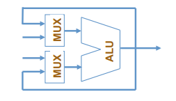

    Vi får nu 1 stall istället:

    

    Vi kan även ändra ordningen på instruktioner för att inte ha efterliggnade registeraccess, se figur

    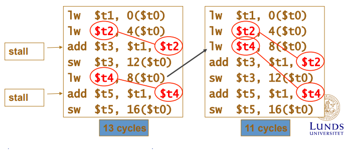

    __Kontroll Hazards__

    Uppstår på grund av hopp (branching).

    _Unconditional Branch_

    Vi försöker alltid beräkna nästa instruktion i en pipeline, 
    men om vi har ett hopp så skall vi ju inte hämta den nästliggande instruktionen. 
    Detta innebär att vi gör en fetch i onödan och vi måste vänta 2 stalls och 
    en felläsning innan vi vet vilken instruktion som är den vi skall hämta 
    (måste göra en fetch operand på branchen där operanden är hoppaddressen), se figur.

    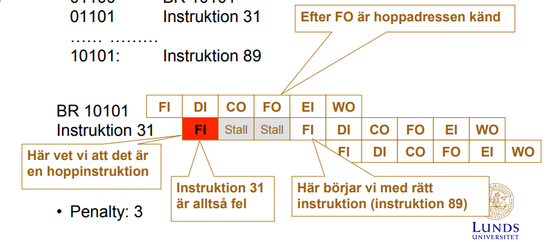

    _Conditional Branch_

    Samma princip gäller här, men här får vi 2 stalls även om vi inte skall hoppa. 
    Vi måste även vänta här på att BEZ branchen har FO rätt address, även om det är nästa.

    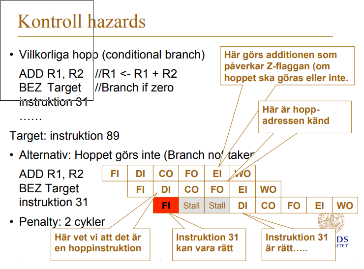

3. __Illustrera hur konflikter uppstår?__

    Se svar till fråga 2.

4. __Vad kan man göra för att undvika konflikter?__

    Se svar till fråga 2.

5. __Vad är branch prediction?__

    _Statisk prediktion_
    Gör ett fast antagande, se figur.

    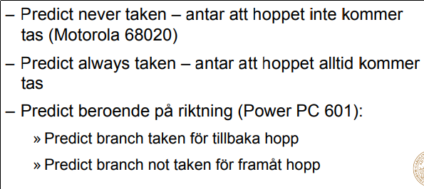

    _Dynamisk prediktion_

    Vi kan göra en kvalificerad gissning för huruvida ett hopp kommer att ske eller ej. 

    __1-bit__: Om vi har gjort ett hopp tidigare kan vi gissa att det kommer att 
    göras igen.

    __2-bit__: Görs med hjälp av en state machine, se figur nedan.

    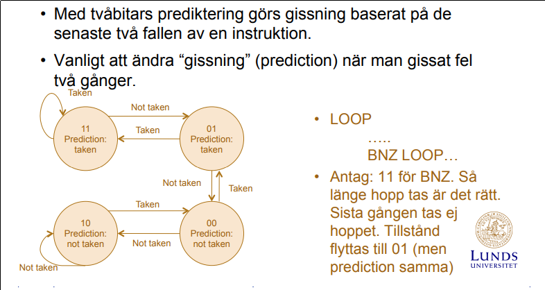

6. __Vad är spekulativ exekvering?__

    När vi börjar exekvera instruktioner baserat på tidigare nämnd branch prediction.

7. __Delayed branching - vad är det? Vinst? Ge exempel.__

    Det är när vi beräknar en instruktion som skall göras men ej påverkar branchen efter 
    branch instruktionen. Då slipper vi en eventuell stall efter i det fall då vi inte skulle 
    göra den beräkningen ((un)conditional branch stall). Nu gör vi alltid en beräkning som 
    alltid ska göras, på så sätt får vi inte en (2-3) onödig stall varje gång efter branch.

    Assemblatorn lägger alltid en _nyttig_ beräkning efter branchen med delay. 
    Innan hade vi alltid stalls.

8. __Delayed load - vad är det? Vinst? Ge ett exempel.__

    När vi använder LOAD och STORE hinner dessa operationer ej 
    utföras på en klockcykel. Detta innebär att om vi försöker LOAD:a ett värde 
    och sedan direkt efter har en instruktion som skall utföra en beräkning med det laddade värde 
    så går detta ej då värdet inte hunnit laddas in. Se figur.

    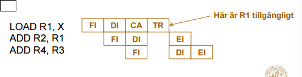

9. __Ge exempel på en kompilatorteknik som används för att undvika/hantera konflikter i pipelinen.__

    Delayed branching, automatisk nop-insättning efter känsliga instruktioner för strukturella- och datakonflikter, som `lw` (Load Word).

## Minne

1. __Hur lagras information på en hårddisk?__

    Lagras med hjälp av sektorer på magnetisk disk.

2. __Vad är random access när man talar om minnen?__

    Minne lagras random, så att accesstiden uppfattas lika för alla hämtningar.

3. __Ge exempel på minne som inte har random access?__

    Sekundärminne (Hårddisk)

4. __Vad är en minneshierarki?__

    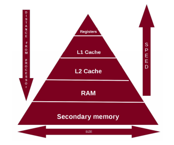

5. __Varför uppstår en minneshierarki?__

    Hastighet, datamängd och pris.

6. __Vad kallas principen som gör att cacheminne fungerar?__

    Om du skall loopa över instruktioner ett flertal gånger så tjänar man på att lagra dessa i cacheminnet. 
    Om du däremot bara läser in instruktioner sekventiellt utan loop så tjänas inget av cachen.

7. __Vad är en cachemiss? Varför uppkommer en cachemiss? Hur hanteras det?__

    En cachemiss är när vi ex. vill läsa eller skriva data till L1 cachen men den har inte addressblocket vi söker. 
    För att hantera detta söker man i nästa cachesteg, L2. Sedan L3. Om detta ej fungerar så måste vi antingen hämta block från primärminnet 
    eller göra en direktskrivning/direktläsning.

8. __Cacheminnen kan ha olika mappningar - vilka? Hur fungerar varje mappning?__

    Direktmappning - Vi söker på cacheline, om vi hittar rätt cacheline då kollar vi om taggen stämmer. Vi lagrar med en direktmappning, 
    det vill säga, cacheline blir 14 least significant bits i primärminnesaddressen och taggen blir 8 most significant bits av primärminnesaddressen.
    Associative mappning - Vi använder nu endast tags, och får göra större sökningar då vi inte har direktmappat minne utan vi slänger in primäraddress 
    som tag (-2 bit för byte target, ges av cpu).
    2-way set associative mappning - Direktmappning fast med ett set om 2 platser.

9. __I direktmappning, hur ersätts cacherader vid cachemissar?__

    De skrivs över.

10. __Vad är en ersättningsalgoritm?__

    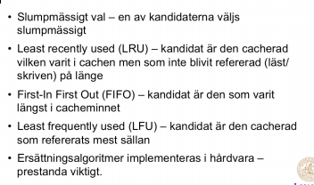

11. __Vad menas med att cacheminnet ej är konsekvent? Och hur hålls ett cacheminne konsekvent?__

    Om vi har en loop där en variabel förändras kommer denna ej ha samma värde i cacheminne som primärminne.

    Såhär gör man,

    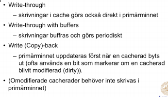

12. __Antag ett program som exekverar alla instruktioner i en sekvens (en i taget) och att det finns ett cacheminne för instruktioner där cacherader har storlek 64bytes och varje instruktion kräver 2 bytes. Vad är sannolikheten för att nästa instruktion finns i samma cacherad som förra instruktion?__

    `1/32`

13. __Vad är fördelen med paging?__

    Ett program består av flera _pages_ och vi laddar inte in hela programmet utan endast de _pages_ som behövs i primärminnet.

14. __Vad är nackdelar med paging?__

    Sidfel.

15. __Vad är fragmentering när vi pratar om paging?__

    När massor med småplatser uppstår primärminnet för page lagring som gör att vi ej kan kicka igång stora program.

16. __Vad är skillnaden på extern fragmentering och intern fragmentering?__

    _Extern fragmentering_

    Ledigt lagringsutrymme som delas upp i mindre platser som inte ligger jämte varandra.

    _Intern fragmentering_

    Allokerar lagringsutrymme som ej används. Filer mindre än blocket gör att vi har slösaktig allokering. 
    Kom ihåg att detta kan vara accepterbart i gengäld mot ökad effektivitet och enkelhet.

17. __Vad är paging?__

    Se svar till fråga 13.

18. __Vad är en sida (page) och en ram (page frame)?__

    Ett program är indelat i flera pages.

    En page frame är en fixt längd av kontinuerligt virtuellt minne.

19. __Om en sida är 2kBytes, kan man säga något om storleken på primärminnet? Kan man säga något om storleken av en ram (page frame)?__

    Vi kan ej avgöra primärminnets storlek. Men vi vet att en page frame har samma storlek som en page, för att förhindra intern fragmentering i en page frame.

20. __Vad är demand paging?__

    Vi laddar endast de sidor som behövs.

21. __Vad är så kallad thrashing? När uppkommer det?__

    Vi försöker byta ut pages från sekundärminne till primärminne för ofta (Många program igång samtidigt).

22. __Vad är skillnaden på paging och virtuellt minne?__

    _virtuellt minne_

    Virtuellt minne är när vi behöver mer minne än vad som finns fysiskt, då allokerar vi en del minne på sekundärminnet för pages.

    _paging_
    
    Vi delar upp vårt program i delar.

23. __Vad är sidfel?__

    När sidan ej finns i primärminnet.

24. __Vad händer vid sidfel? Hur hanteras det?__

    Vi får en miss i primärminnet och laddar då in sidan från sekundärminnet in i primärminnet i en ram.

## Operativsystem

1. __Vad gör ett operativsystem?__

    Programvara som agerar abstraktion mellan maskinvara och applikationer (Tillämpningsprogram).

2. __Vad är multitasking?__

    Körning av flera processer samtidigt.

3. __En användare känner att flera program exekverar samtidigt, hur är det möjligt?__

    Schemaläggaren hanterar exekvering, tilldelar körningstid.

4. __Vad är ett kontextbyte?__

    Ett byte av tråd som exekverar.

5. __Hur går det till? Hur vet man om att det ska ske? Vem är inblandad?__

    Vi sparar det körande stadiet och sedan laddar vi in det stadie som skall köras. 
    Sedan körs detta stadie, och sparas sedan när vi vill ladda tillbaka det som kördes från första början.

    Det genereras av en extern klocka eller när ett program gör ett systemanrop.

    Schemaläggaren är inblandad.

6. __Behövs avbrott för att klara av att göra kontextbyten?__

    Ja.

7. __Hur fungerar avbrott?__

    Vi sparar vår stackpekare och hoppar till en avbrottsstack för att undvika att 
    minnet tar slut för det program som körs.

8. __Om man skapar en struktur för att lagra filer, vad vill man uppnå?__

    Målet är att vi skall kunna lagra stora filer och nå dem snabbt. (Utnyttja hårddisken maximalt)

9. __Om man ska läsa in en fil från en hårddisk, vad påverkar lästiden?__

    Läshastighet på hårddisk. Nuvarande användning av hårddisken (Aktivitet). 
    Filsystemsformat. Fragmentering.

## Cacheminne

1. __Vad är skillnaden mellan primärminne och sekundärminne?__

    Se svar till fråga _Processorn_ 15, 17.

2. __Om du skall föreslå ett sätt att lagra filer på ett sekundärminne, 
vilka avvägningar gör du (och vilka parametrar avgör)?__

    Cluster skall ligga så nära varandra som möjligt. 
    Vi bör ha en ordentlig datastruktur för att inte behöva lägga ner tid 
    att söka efter våra cluster. Små cluster kan ge mindre fragmentering.

3. __Varför behövs cacheminnen?__

    För att effektivisera processorns exekveringstid. Hämtningar är den 
    den svaga länken.

4. __Vad är en minneshierarki?__

    Se svar till _Minne_ fråga 4.

5. __Vilken princip gör att cacheminnen fungerar?__

    Se svar till _Minne_ fråga 6.

6. __Vad är en cacherad?__

    En cacherad innehåller tag, cacheline och data.

7. __På vilka sätt kan man bygga ett cacheminne?__

    Vi kan ha ett cacheminne till data och ett till instruktioner. 
    Eller så har vi ett unified cacheminne.

8. __Vilka paramterar måste man bestämma om man har ett cacheminne av 
storlek N bytes som ska användas till ett primärminne med storlek M bytes?__

    Tag, cacheline, Valid bit.

9. __Vad gör en tag?__

    Identifierar en cacherad.

10. __Varför har man flera nivåer i ett cachesystem?__

    För att kunna lagra det man använde absolut senaste och om det
    inte är absolut senaste så finns det i en nivå upp. Och vi har flera nivåer 
    då vi vill ha små och snabba cacheminnen. Så vi baserar cachestorlek på lokalitetsprincip.

11. __Varför har man I-cache och D-cache?__

    För att minimera stalls i pipeline. FO, WO och FI, FO kan göras samtidigt.

12. __Vad är TLB?__

    Translation Look-Aside Buffer.

    Det är i princip en cache för endast pages. 
    Används för att minimera tiden för att hitta en page location.

13.  __Måste man ha en skrivstrategi?__

    Ja.

14. __Varför används paging?__

    För att dela upp ett program i flera sidor, detta tillåter oss att använda 
    primärminnet för att köra program.

15. __Var lagrar man sidtabellen?__

    I det virtuella minnet.

## Pipelining

16. __Hur många instruktioner är aktiva i en pipeline med 6-steg?__

    6

17. __Hur påverkas kontrollenheten av pipelining?__

    ..

18. __Vilka problem kan uppkomma med pipelining?__

    Se svar till _Pipelining_ fråga 2.

19. __Ge exempel på hur dessa problem uppkommer.__

    Se svar till _Pipelining_ fråga 2.

20. __Hur löser man dessa problem?__

    Se svar till _Pipelining_ fråga 2.

21. __Hur kan kompilatorn förhindra dessa problem?__

    Automatic nopping eller ändring av ordning.

22. __Vad är en _LOAD_ & _STORE_ arkitektur?__

    RISC är ett exempel på en LOAD, STORE arkitektur. 
    Det bygger på att man läser och skriver mellan register och minne.

## Parallellism

1. __Vad är superscalar?__

    En arkitektur som tillåter att mer än en instruktion initieras samtidigt. 
    De exekveras oberoende av varandra.

2. __Vad är superscalar pipelining?__

    Det ger oss möjligheten att initiera flera instruktioner samtidigt i samma pipeline steg. 
    Det är möjligt att initiera flera instruktioner i samma klockcykel.

3. __Vad är skillnaden mellan en superscalar processor och en very long instruction word processor?__

    _VLIW_ använder kompilatorn för att detektera parallelism.

    _Superscalar_ använder hårdvaran för att detektera parallelism.

4. __Vad är skillnaden mellan en tråd och en process?__

    _Tråd_: Delar resurser

    _Process_: Mer oberoende

5. __Vad är skillnaden mellan en process och en processor?__

    Ett program är en del av en process som exekveras på en processor.

6. __Hur klassificerar Flynn arkitekturer?__

    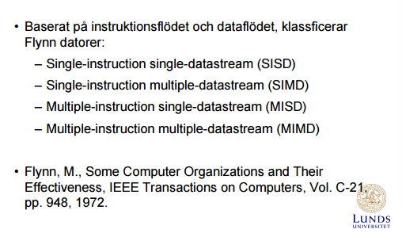

7. __Vad hindrar en processor med 4 cores att exekvera ett program 4 gånger snabbare än en processor med 1 core?__

    Programmet är ej optimerat för parallelism.

8. __Vad menas med Amdahls lag?__

    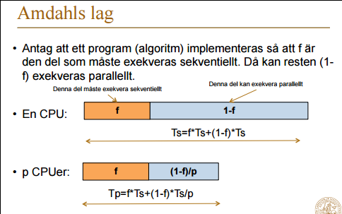

9. __Vilka konflikter uppkommer i en superscalar processor?__

    Man behöver mycket hårdvara för att detektera möjlig parallelism. 
    Hög effektförbrukning på grund av hårdvara.

    Begränsat instruktionsfönster, det gör att det blir svårare att hitta instruktioner 
    som har möjlighet att exekveras parallellt.

10. __Vad är in-order och out-of order issue/completion?__

    _In-order issue with in-order completion_

    Vi gör en beräkning under samma cykel då vi får ett svar för en av våra beroende operander.

    _In-order issue with out-of order completion_

    Ingen kontroll över när en beräkning färdigställs.

    _Out-of order issue with out-of order completion_

    Ingen kontroll, allt ballar ur.

11. __Varför används register renaming?__

    Optimering för att kunna lägga instrukioner i en annan ordning.

12. __Vad är multithreading?__

    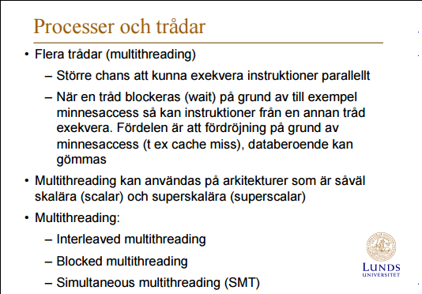
