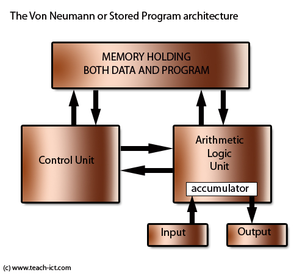
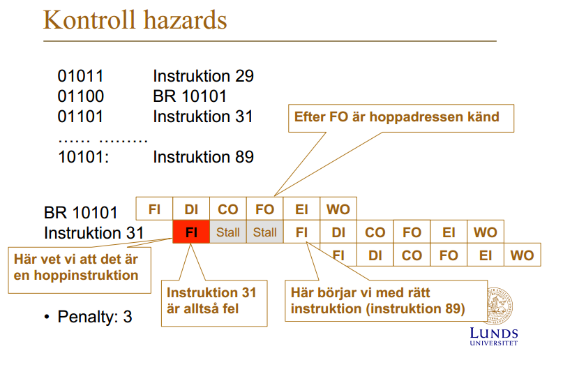
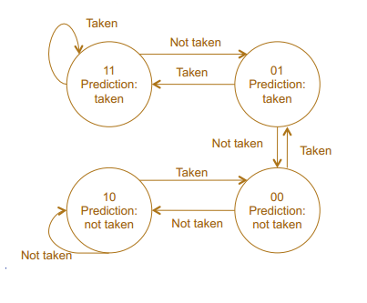

**Varning:** Dessa svar är skrivna av studenter och är därför inte garanterat rätt och absolut inte förklarat på bästa sätt, förbättringar välkomnas!

## Processorn

1. Vad  är  Moores  lag?
    
    Moores lag är observationen att antalet transistorer i en integrerad krets dubbleras ungefär vartannat år.

2. Vem  är  Von  Neumann?
    
    John von Neumann var en matematiker som bland annat beskrev den datorarkitektur som lade grunden till dagens moderna datorarkitekturer. Den datorarkitekturen, Von-Neumann arkitekturen, gick ut på att se program och datan som programmet använder, som samma sak och placera de i samma minne. Här är ett diagram som visar Von-Neumann arkitektur.

    

    [(Källa)](http://www.teach-ict.com/as_as_computing/ocr/H447/F453/3_3_3/vonn_neuman/miniweb/pg3.htm)

3. Vad  gör  en  kompilator?
    
    En kompilator översätter ett högnivå programspråk till ett annat med lägre nivå, ofta assembly eller direkt till maskinkod.

4. Vad  gör  en  assemblator?
    
    Assemblerar assemblerkod till maskinkod.

5. Ge  exempel  på  högnivåspråk?

    C och C++ är de vanligaste språken som kompilerar till assembler eller maskinkod medans Java är ett annat exempel som kompilerar till bytekod som sedan körs av en virtuell maskin (i detta fall JVM).

6. Vad  skiljer  ett  högnivåspråk  från  ett  maskinspråk?

    Datorn kan inte direkt läsa ett högnivåspråk utan det måste genomgå kompilation till maskinspråk (eller bytekod om det ska köras i t.ex. JVM) för att kunna exekveras. Det är också lättare att producera kod säkert och lättförståerligt i högnivåspråk, medans assembly-kod tenderar att vara jobbigt att både utveckla och förstå/läsa.

7. Görs  alla  beräkningar  (+, -,  ...,  AND,  OR)  i  ALU:n?

    Nej, inte de som involverar flyttal.

8. Ge  exempel  på  indata  och  utdata  till  en  kontrollenhet
    
9. Ge  exempel  på  fördelar  med  att  använda  register  för  att  lagra  data
    
    Data i register tar mindre tid att hämta än data i t.ex. CPU cache, RAM-minne eller från disk. Det går även snabbare att spara till register. I en pipelinearkitektur så kan dessutom register användas av flera instruktioner samtidigt, vilket inte är möjligt med t.ex. primärminne.

10. Om  en  processor  gör  ”Fetch”  och  ”Execute”,  vad  görs  under  ”Fetch?  Vad  görs  under  ”Execute”?  Är  det  som  görs  under  ”Fetch”  samma  för  alla  instruktioner”
    
    

## Pipelining

1. Vad  är  pipelining?
    
    Pipelining är när processorn kör flera olika instruktioner samtidigt genom att tillåta en instruktion i varje fas (t.ex en i "Fetch" och en i "Execute").

2. Vilka  konflikter  kan  uppstå  i  en  pipeline?  

    **Strukturella konflikter**

    När en två pipelineade instruktioner försöker använda en hårdvarukomponent (ex. primärminnet) samtidigt

    **Datakonflikter**

    När en instruktion beror på data som påverkas av en exekverande instruktion (Uppstår när en instruktion väntar på resultaten från en annan instruktion)
    Penalty kan minskas med hjälp av forwarding/bypassing.
    Instruktionerna kan även omordnas så att andra instruktioner körs medans den beroende instruktionen ändå bara hade väntat på svar.

    **Kontrollkonflikter**

    När en instruktion som låg direkt efter en branch instruktion påbörjat exekvering, men som senare visar sig *inte* ska exekveras. Alltså då om branchen genomfördes.

3. Illustrera  hur  konflikter  uppstår?

    Denna bilden är hämtad från pipelining föreläsningen.
    
    
    
4. Vad  kan  man  göra  för  att  undvika  konflikter? 

    Generell åtgärd är att sätta stalls, eller 'nop'-instruktioner, efter varje instruktion som kan orsaka en pipelinekonflikt.
    En annan åtgärd, inriktat mot att förhindra kontrollkonflikter, är att använda sig av delayed branching (förklaras nedan.)

5. Vad  är  branchpredikion? 

    
    När processorn försöker, med hjälp av en predictionalgoritm, gissa vilken väg en kommande branch-instruktion kommer ta. Det finns två generella strategier för detta:
    
    **Alternativ förklaring:** Ett sätt att undvika control hazards genom att förutse om en conditional branch-instruktion kommer att leda till branch eller ej och börjar exekvera nästkommande spekulerade instruktion, så kallad spekulativ exekvering.

    **Statisk prediktion**, där man *inte* tar hänsyn till historiken. Olika implementeringar:

    - Predict never taken – antar att hoppet inte kommer
tas (Motorola 68020)
    - Predict always taken – antar att hoppet alltid kommer tas
    - Predict beroende på riktning (Power PC 601):
      - Predict branch taken för tillbaka hopp
      - Predict branch not taken för framåt hopp'
            
    **Dynamisk prediktion**, där man tar hänsyn till historiken:

    - 1-bit prediktering: Man sparar vad som hände vid förra branchen, och antar att samma kommer hända vid nästa branch-instruktion.
    - 2-bit prediktering: Man använder en state-machine, vilket är lättast förstått av att titta på diagrammet nedan, som är hämtat från Pipelining föreläsningen.

    
    

6. Vad  är  spekulativ  exekvering?

    När processorn börjar exekvera instruktioner baserat på branch-gissningen gjord av en branch-prediction.

7. Delayed  branching  – vad  är  det?  Ge  ett  exempel.

    När instruktioner körda innan en branch-instruktion, som inte kommer påverka om branchen kommer genomgöras eller ej, läggs precis efter en branch-instruktion så stall/nop inte behövs.

    Ett exempel *innan* delayed branching:
    
        ...
        add $5, $6              # $5 = $5 + $6, i.e. something that doesn't affect the beq statement
        beq $1, $2, some_label  # Branch to some_label if $1 == $2
        nop
        ...
    
    Ett exempel *med* delayed branching:
    
        ...
        beq $1, $2, some_label  # Branch to some_label if $1 == $2
        add $5, $6              # $5 = $5 + $6. Now replaces the nop statement
        ...
    
    **Alternativ förklaring:** Det är att assemblern ordnar om instruktionerna så att något alltid görs direkt efter en 
    branch instruktion (i branch delay slot) där processorn annars hade idlat.

8. Ge  exempel  på  en  kompilatorteknik  som  kan  användas  för  att  unvika/hantera  konflikter i pipelinen.

    Delayed branching är en teknik som kompilatorer kan använda för att minska pipelinekonflikter.
    Även automatisk nop-insättning efter alla instruktioner känsliga för strukturella- och datakonflikter, som `lw` (Load word).

    Båda dessa utnyttjas när man anger assemblydirektivet '.setreorder' i MIPS.

## Minne

1. Hur  lagras  information  på  en  hårddisk?

    En hårddisk (ej SSDs) lagrar information på magnetiska skivor som läses med ett läshuvud.

2. Vad  är  random  access  när  man  talar  om  minnen?

    Att alla sektorer på minnet tar lika ungefär lång tid att hämta.

3. Ge  exempel  på  minne  som  inte  har  random  access?

    I hårddiskar (ej SSDs) kan olika sektorer ta olika lång tid att hämta beroende på sektorns avstånd från läshuvudet tidigare position. 
    Därmed går det snabbare att läsa i sekvens på hårddiskar. 
    Defragmentering kan användas för att minimera avståndet mellan relaterade sektorer.

4. Vad  är  en  minneshierarki?

    En minneshierarki är ett system där man har snabba, men små, minnen högst upp (närmast CPUn) och långsamma, men stora, minnen längst ner (längst ifrån CPUn). 

    Det finns ofta flera nivåer emellan, ett exempel på en vanlig hierarki är: 
     - Register
     - L1 cache
     - L2 cache
     - L3 cache
     - RAM
     - Hårddiskar (som i sig själva kan innehålla minneshierarkier då de själva har cacheminne)
     - Externa lagringsmedia
     
     Siffror som 

5. Varför  uppstår  en  minneshierarki? 

    En minneshierarki uppstår för att vi kan inte ha både stora och snabba minnen; man måste kompromissa. Därför lägger man mindre, snabbare minnen närmare processorn för att öka snabbheten och minska accesstid och större, långsammare minnen längre från processorn. 

6. Vad  kallas  principen  som  gör  att  cacheminne  fungerar?  Förklara  principen.  Ge  ett  exempel  på  programkod  där  cacheminne  INTE  ger  någon  vinst.  
    
    Lokalitetsprincipen, gör 

    Principen är *Lokalitet av referenser*, varpå det finns två viktiga subprinciper:
		* Temporal lokalitet:
			Om en instruktion/data blivit refererad nu, så är sannlokhuteten stor att samma referens görs inom kort.
		* Rumslokalitet:
			Om instruktion/data blivit refererat nu, så är sannolikheten stor att instruktioner/data vid addresser i närheten kommer användas inom kort.
    
7. Vad  är  en  cachemiss?  Varför  uppkommer  cachemissar?  Hur  hanteras  det?  

8. Cacheminnen  kan  ha  olika  mappningar – vilka?  Hur  fungerar  varje  mappning? 

    - **Direktmappning**
        Man placerar instruktionen på *nästan* samma plats som den är på i minnet. Man placerar den på följande index:
		`Cacheindex = Instruktionens address i minnet % cachestorlek`
		Är den platsen i cachen upptagen av något annat så skriver man helt enkelt över det.
		
	- **Associativemappning**
		Innebär att man bara fyller på cacheminnet på följd och använder ersättningsalgoritm vid cachemiss i ett fullt cacheminne.

	- **Set-associative mappning**
		Detta är en blandning mellan direkt- och associativmappning. Man delar in cacheminnet i flera *sets*, mappar vissa instruktionsaddresser till dessa sets, och använder associativmappning inom varje set. Ett exempel skulle vara om man har två sets, en för alla instruktioner med en udda address och en för alla med jämn address. Inom varje set använder man dock associativmappning.

9. I  direktmappning,  hur  ersätts  cacherader  vid  cachemissar?

    De skrivs över utan vidare.

10. Vad  är  en  ersättningsalgoritm?    
 
    En algoritm som används vid associativemappning (samt inuti varje set i set-associative mappning) för att bestämma vilken/vilket cacherad/cacheblock som ska kastas ut för att göra plats för det nya. Det finns tre stycken nämnda i cacheminneföreläsningen i denna kursen:

    - **Least recently used (LRU)** – kandidat är den cacherad vilken varit i cachen men som inte blivit refererad (läst/skriven) på länge
    - **First-In First Out (FIFO)** – kandidat är den som varit längst i cacheminnet
    - **Least frequently used (LFU)** – kandidat är den cacherad som refererats mest sällan 

11. Vad  menas  med  att  cacheminnet  inte  är  konsistent?  Hur  hålls  ett  cacheminne  konsistent?

12. Antag  ett  program  som  exekverar  alla  instruktioner  i  en  sekvens  (en  i  taget)  och  att  det  finns  ett  cacheminne  för  instruktioner  där  cacherader  har  storlek  64bytes  och  varje  instruktion  kräver  2  bytes.  Vad  är  sannolikheten  för  att  nästa  instruktion  finns  i  samma cacherad  som  förra  instruktion?

    Sannolikheten är 1/32.

13. Vad  är  fördelen  med  paging?

    Att man dynamiskt laddar in data i minnet på begäran och laddar ur det när det ej används.

14. Vad  är  nackdelar  med  paging?

    Det tar tid att ladda in och ur sidor ur minnet.

15. Vad  är  fragmentering  när  vi  pratar  om  paging?

    

16. Vad  är  skillnaden  på  extern  fragmentering  och  inter  fragmentering?

    Intern fragmentering är när hela kapaciteten av ett block inte används.
    Extern fragmentering är när det uppstår icke-allokerade luckor i minnet mellan allokerade segment.

17. Vad  är  paging?

    Paging är en metod för att ladda in program och data från sekundärminnet till primärminnet.    

18. Vad  är  en  sida  (page),  ram  (frame)?

    Primärminnet är uppdelat i frames, som kan fyllas med pages som är uppdelade program eller data.

19. Om  en  sida  är  2  kBytes,  kan  man  säga  något  om  storleken  på  primärminnet?  Kan  man  säga  något  om  storleken  av  en  ram?

20. Vad  är  demand  paging?

    Demand paging är när sidor endast laddas när deras innehåll efterfrågas och aldrig innan.

21. Vad  är  så  kallad   trashing?  När  uppkommer  det?

    Thrashing uppkommer när ett program friar upp ramar som regelbundet används.
    Detta gör att de genomgår flera cykler av att laddas in och laddas ur under 
    kort tid vilket leder till att en stor mängd resurser går åt att ladda in och ur sidor minnet.

22. Vad  är  skillnaden  på  paging  och  virtuellt  minne?

    Virtuellt minne mappar en process virtuella adressintervall till sidor i primärminnet eller data i sekundärminnet.
    Paging hanterar (ur)laddningen av data från sekundärminnet till primärminnet.

23. Vad  är  sidfel?
    
    Sidfel är när ett program försöker komma åt data som inte ligger i RAM minnet.

24. Vad  händer  vid  sidfel?  Hur  hanteras  det?

    Operativsystemet fångar upp felet, 
    letar upp datan i sekundärminnet, 
    skaffar sig en tom ram,
    om ingen tom ram finns så används en sidersättningsalgoritm för att fria upp en ram,
    datan laddas in i ramen som läggs till i sidtabellen, 
    instruktionen som gav upphov till felet körs om och
    återställer därmed kontrollen till programmet.

## Operativsystem

1. Vad  gör  ett  operativsystem?

    Kärnan hanterar hårdvaruresurser, t.ex. arbetsminne, in/ut-enheter och processortid. Användarprogram 
    
    *Alternativt svar:* 
    - Filsystemshantering
    - Minneshantering
    - Processhantering
    - Avbrott
    - In- och utmatning
    - Nätverk
    - Säkerhet
    - Drivrutiner

2. Vad  är  multitasking?

    Att flera program körs samtidigt (eller iallafall att det uppfattas som att de gör det)

3. En  användare  känner  att  flera  program  exekverar  samtidigt,  hur  är  det möjligt?  

    Schemaläggaren tilldelar klockcykler på ett sådant sätt att användaren inte märker av att saker görs i en viss ordning och inte samtidigt.

4. Vad  är  ett  kontextbyte?

    Ett byte av vilken tråd som för stunden exekverar.

5. Hur  går  ett  kontextbyte  till?  Hur  vet  man  om  att  det  ska  ske?  Vem  är  inblandad?  

    Först har schemaläggaren beslutat om ett byte mellan två trådar. När detta byte sedan genomförs så sparas tillståndet (t.ex. register) undan för 
    den nuvarande tråden för att den nya tråden ska kunna ladda in det tillstånd som den nya tråden har undansparat sedan tidigare,
    detta är för att bevara trådar/processers tillstånd mellan byte av trådar.

6. Behövs  avbrott  för  att  klara  av  att  göra  kontextbyten?

    Nej, man kan också göra det genom 

7. Hur  fungerar  avbrott?

8. Om  man  skapar  en  struktur  för  att  lagra  filer,  vad  vill  man  uppnå?

    Kunna strukturellt allokera utrymme åt filer på disken.

9. Om  man  ska  läsa  in  en  fil  från  en  hårddisk,  vad  påverkar  lästiden?

    Fragmentering
    Filsystemet
    Hårddiskens specifikationer
    

-------
Källan för instuderingsfrågorna finns i `instuderingfrågor.pdf` som ursprungligen kommer [härifrån](http://www.eit.lth.se/fileadmin/eit/courses/eit070/2015/Instuderingsfr%E5gor.pdf).
