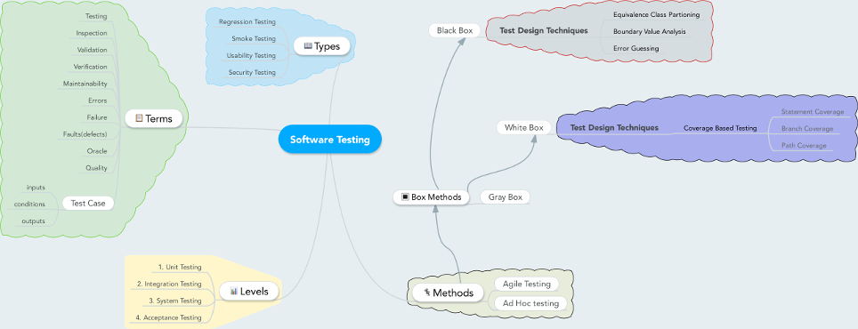

# Software Testing

## Menu
- [Terms](terms.md)
- [Types](types.md)
- [Levels](levels.md)
- [Methods](methods.md)
    - **Box Methods**
          - [White Box](whitebox.md)
          - [Black Box](blackbox.md)

## Mind Map
[Press here for large image](img/mindmap-large.png).

## Videos
Some section, such as this one, contains videos that I've found useful.

The videos below gives an introduction to software testing.

- Why testing is important <https://www.youtube.com/watch?v=TDynSmrzpXw> 

- Seven testing principles <https://www.youtube.com/watch?v=rFaWOw8bIMM>

- Software Development Life Cycle vs. Software Test Life Cycle <https://www.youtube.com/watch?v=An7HC1LolDM>

## Anki

Some sections contains Anki files. 

"Anki is a program which makes remembering things easy. Because it's a lot more efficient than traditional study methods, you can either greatly decrease your time spent studying, or greatly increase the amount you learn."

Read more here: <http://ankisrs.net/>

## Sources

- Practical Software Testing: A Process-Oriented Approach by *Ilene Burnstein*

- <http://www.guru99.com/software-testing.html>

- <http://softwaretestingfundamentals.com/>

- <http://www.tutorialspoint.com/software_testing_dictionary/index.htm>

- <http://istqbexamcertification.com/what-is-the-istqb-agile-tester-extension-certification/>

- <http://www.webopedia.com/>

