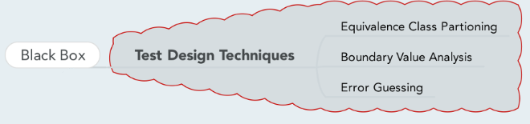

# Black box

- [Back to index](README.md)

## Anki

- [Anki SoftwareTesting-blackbox (apkg file)](anki/SoftwareTesting-Blackbox.apkg)

## Mindmap

## Videos

- Equivalence Partitoning and Boundary Value Analysis <https://www.youtube.com/watch?v=uydAyjqTSiw>

## Black Box
When the tester is using the **black box** approach, the software under test is considered a opaque box. There is **no knowledge of its inner structure** (i.e. how it works). The tester only knows what it does.

> **Definition** (ISTQB): black box testing is testing, either functional or non-functional, without reference to the internal structure of the component or system. 

Black box testing is **applicable** in *integration* testing, *system* testing and *acceptance* testing.

### Methods / testing techniques
- **Random Testing**

  Random testing is when the tester randomly selects input from the domain. Random testing may save some of the time and effort that more thoughful test input selection methods require. However, according to many testing experts, selecting inputs ranmodly has very little chance of producing an effective set of test data.

- **Equivalence Class partitioning**

  Equivalence Class partioning involves dividing (i.e. to partition) a set of test conditions into groups or sets that can be considered the same (i.e. the system should handle them equivalentnly). We then only test one condition from each group, since all conditions should be treated in the same way by the system anyway. If one condition in a partion works, we assume all of the conditions in that partion will work. 

- **Boundary Value Analysis**

  In Boundary value analysis the value that are just inside/outside the boundaries (partions) are tested.  That includes both valid boundaries and invalid boundaries. BVA used together with Equivalence Class Partitioning usually gives a very effective test set.

- **Cause-and-effect graphing**

  Cause and effect graphing identifies the cases (input conditions) and effects (output conditions) and produces a Cause-Effect Graph and then generates test cases accordingly.

- **State transition testing**

  State transition testing views the software under testing as a finite-state machine. This gives the tester additional opportunity to develop test cases to detect defects that may not be revealed using the input/output condition as well as cause-and-effect views presented by equivalence class partioning and cause-and-effect graphing.

- **Error guessing**

  Error guessing is where the devolper uses his experience and intuition to try to find where defects may lurk in the code. The tester/developer might have past experience of similar code and can sometime make an educated "guess" as to which types of defects may be present and design test cases to reveal them.

### Pros and cons
**Advantages**:

+ Testing are done from a user's point of view and will help in exposing discrepancies in the specification.
+ Tester need not know programming languages or how the software has been implemented.
+ Tests can be conducted by a body independent from the developers, allowing for an objective perspective and the avoidance of developer-bias.
+ Test cases can be designed as soon as the specifications are complete.

**Disadvantages**:

- Only a small number of possible inputs can be tested and many program paths will be left untested.
- Without clear specification, which is the situation in many projects, test cases will be difficult to design.
- Tests can be redundant if the software designer/developer has already run a test case.

## Black box vs. White box Testing
**Black box** testing is more applicable to **higher levels** of testing such as **Acceptance Testing** and **System testing**.

**White box** testing is more applicable to **lower levels** of testing such as **Unit Testing** and **Integration testing**.

**Black box** testing is generally done by **independent software testers**.
**White box** testing is generally done by **software developers**.

**Black box** testing is doesn't need **programming knowledge** or **implementation knowledge** wheras **white box** testing requires both.

