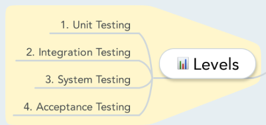

# Levels

- [Back to index](README.md)

## Anki

- [Anki SoftwareTesting-levels (apkg file)](anki/SoftwareTesting-Levels.apkg)

## Mindmap

## Videos

- Integration testing <https://www.youtube.com/watch?v=QYCaaNz8emY>

- System testing <https://www.youtube.com/watch?v=CC0He-SS-Do>

## Software Testing Levels
There are four levels of software testing.

1. **Unit Testing** is a level of the software testing process where individual units/components of a software/system are tested. The purpose is to validate that each unit of the software performs as designed.

2. **Integration Testing** is a level of the software testing process where individual units are combined and tested as a group. the purpose of this level of testing is to expose faults in the interaction between integrated units.

3. **System Testing** is a level of the software testing process where a complete, integrated system/software is tested. The purpose of this test is to evaluate the system's compliance with the specified requirements.

4. **Acceptance Testing** is a level of the software testing process where a system is tested for acceptability. The purpose of this test is to evaluate the system's compliance with the business requirements and assess whether it is acceptable for delivery.

**Regression testing** is not a separate level of software testing. Is is just a type of testing that can be performed at any of the four main levels.

