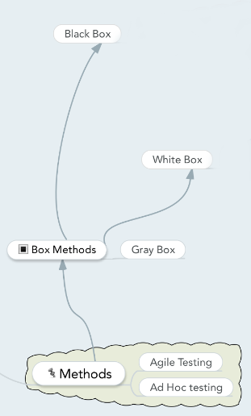

# Methods

- [Back to index](README.md)

## Anki

- [Anki SoftwareTesting-methods (apkg file)](anki/SoftwareTesting-Methods.apkg)

## Mindmap

## Different Testing Methods

There are many different methods for testing. Some can be seen below:

- [Black box](blackbox.md) testing

- [White box](whitebox.md) testing

- Gray Box testing

- Agile Testing

- Ad Hoc Testing

### Black Box Testing
Black box testing is a software testing method in which the internal structure/design/implementation of the item being tested is not known to the tester. These tests can be functional or non-functional, though usually functional. Test design techniques include: Equivalence partitioning, Boundary Value Analysis, Cause Effect Graphing.

### White Box Testing
White box testing is a software testing method in which the internal structure/design/implementation of the item being tested is known to the tester. Test design techniques include: Control flow testing, Data flow testing, Branch testing, Path testing.

### Gray box Testing
Gray Box Testing is a software testing method which is a combination of Black Box Testing method and White Box Testing method. In Black Box Testing, the internal structure of the item being tested is unknown to the tester and in White Box Testing the internal structure in known. In Gray Box Testing, the internal structure is partially known. This involves having access to internal data structures and algorithms for purposes of designing the test cases, but testing at the user, or black-box level.

### Agile Testing
Agile Testing is a software testing practice that follows the principles of agile software development. Agile is an iterative development methodology, where requirements evolve through collaboration between the customer and self-organizing teams and agile aligns development with customer needs.

Some advantages of Agile Testing is:

- Agile testing Saves Time and Money

- Less Documentation

- Regular feedback from the end user

- Daily meetings can help to determine the issues well in advance

### Ad Hoc testing
Ad Hoc testing is a method of software testing without any planning and documentation.

