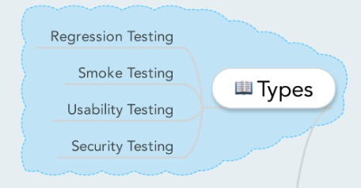

# Types

- [Back to index](README.md)

## Anki

- [Anki SoftwareTesting-types (apkg file)](anki/SoftwareTesting-Types.apkg)

## Mindmap

## Types of testing

### Regression Testing
Regression testing is a type of software testing that intends to ensure that **changes** (enhancements or defect fixes) to the software have not adversely affected it.

Any code change have a likelihood af impacting functionalities that are not directly associated with the code currentrly being changed. Therefore it is important to perform regression testing to ensure that fixing one thing has not broken another thing. 

During regression testing new test cases are **not** created. Previously created test cases are re-executed.

**Levels applicable to regression testing**:

Regression testing can be performed during any level of testing (Unit, Integration, System or Acceptance) but it is **mostly relevant** during **System Testing**.

### Smoke Testing
The term **smoke testing** is said to come from hardware testing, where the device passed the test if it did not catch fire (or smoked) the first time it was turned on.

Smoke testing (also known as **build verification testing**) is a type of software testing that comprises of a non-exhausitve set of test that aim to ensure that the most important functions work. The result of this test is used to decide if a build is stable enough to proceed with further testing. 

Smoke testing cover most of the major functions but none of them in depth.

**Advantages**:

- It exposes integration issues

- It uncovers problems early

- It provides some level of confidence that changes to the software have not adversely affected major areas (the areas covered by smoke testing, of course).

Smoke testing is **applicable** to:

- Integration Testing

- System Testing

- Acceptance Testing

### Usability Testing
Usability testing is done from an end-user's perspective to determine if the system is easily usable.

> **Definition** (ISTQB): usability testing is testing to determine the extent to which the software product is understood, easy to learn, easy to operate and attractive to the users under specified conditions.

Levels that are **applicable** to usability testing is System Testing and Acceptance Testing.

### Security Testing
Security Testing is a type of software testing that intends to uncover vulnerabilities of the system and determine that its data and resources are protected from possible intruders.

**OWASP** (Open Web Application Security Project) is a great resource for software security professionals.
Source: [OWASP](https://www.owasp.org/index.php/Category:OWASP_Testing_Project).

#### Focus Areas
There are four main focus areas to be considered during security testing:

1. **Network Security**

2. **System software security**

3. **Client-side application security**

4. **Server-side application security**

### Functional Testing
In function testing the software is tested against the functional requirements/specification.
During functional testing black box testing is used. Functional testing is normally performed during the levels of **System Testing** and **Acceptance Testing**. 

**Steps** in functional testing:

- Identify functions that the software is expected to perform.

- Create input date based on the function's specification.

- Determine the output based on the function's specification.

- Execute the test case.

- Compare the actual and expected outputs.

### Performance Testing
Performance Testing intends to determine how a system performs in terms of responsiveness and stability under a certain load. 

**Types**:

- **Load Testing**

- **Stress Testing**

- **Endurance Testing**

- **Spike Testing**

### Compliance Testing
Compliance testing (also knows as **conformance testing**, **regulation testing**, **standards testing**) is a type of testing to determine the compliance with internal or external standards.

