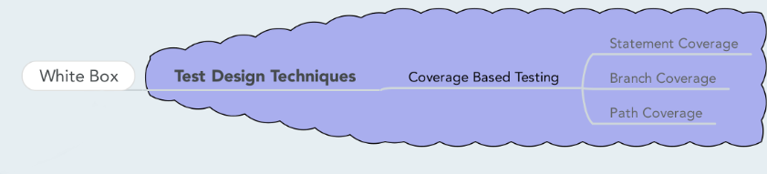

# White box

- [Back to index](README.md)

## Anki

- [Anki SoftwareTesting-whitebox (apkg file)](anki/SoftwareTesting-Whitebox.apkg)

## Mindmap

## Video
<https://www.youtube.com/watch?v=3bJcvBLJViQ>

## White box
White box is sometimes called clear or glassbox testing.
White box focuses on the inner structure of the software to be tested. To design test cases using this strategy the tester must have a knowledge of that structure. The code must be available. The tester selects test cases to exercise specific internal structural elements to determine if they are woring properly. For example, test cases are often designed to exercise all statements or true/false branches that occur in a module or member function. Since designing, executing, and analyzing the results of white box testing is **very time consuming**, this strategy is usually applied to smaller-sized pieces of software such as a module or member function.

The **goal** for white box testing is to ensure that the internal components of a program are working properly.

> **Definition** (ISTQB): white-box testing is based on an analysis of the internal structure of the component or system.

White box testing is **applicable** in **unit testing**, **integration testing** and **system testing**. White box testing is mainly used in unit testing.

### Methods / testing techniques
- **Test Adequacy Criteria**
  
  Testers need a framework for eciding which structural elements to select as the focus of testing, for choosing the appropirate test date and for deciding when the testing efforts are adequate enough to terminate the process with confidence that the software is working properly. Test Adequacy Critiera is such a framework. 

- **Coverage and Control Flow Graphs**

  Control flow graphs represents the control flow of the program. The nodes are statements in the program and the edges are the control flow between the statements. The flow graph can be used by the tester to evaluate the code with respect to its testability, as well as to develop white box test cases.

Often white box testing focuses on one or more *coverage critierias*. 

- **Function coverage**: has each function in the program been called?
- **Statement coverage**: has each statement in the program been executed?
- **Decision/Branch coverage**: Has each branch of each control structure been executed? For example, given an `if` statement, have both the `true` and `false` branches been executed? Another way of saying this is, has every *edge* been executed? 
- **Condition coverage**: has each boolean sub-expression evaluated to both `true` and `false`? 

Coverage critiera satisfaction is *alone*  a poor indicition of test suite effectiveness.

### Pros and cons
**Advantages**:

+ Testing can be commenced at an earlier stage. One need not to wait for the GUI to be available.

+ Testing is more thorough, with the possibility of covering most paths.

**Disadvantages**:

- Since tests can be very complex, highly skilled resources are required, with thorough knowledge of programming and implementation.

- Test script maintenance can be a burden if the implementation changes too frequently.

- Since this method of testing is closely tied with the application being tested, tools to cater to every kind of implementation/platform may not be readily available.

## McCabe Cyclomatic Complexity
Cyclomatic Complexity is a software measurment that is used to indicate the complexity of a program. It was developed by Thomas J. McCabe.

The cyclomatic complexity of a *structured program* is defined with reference to the control flow graph. The complexity **M** is defined as:

$$ M = E - N + 2 P $$

Where

- **E** is the number of edges in the graph.

- **N** is the number of nodes.

- **P** is the number of *connected components* (quite often P=1).

Cyclomatic complexity for a flow graph gives an approximation (usually an upper limit) of the number of tests needed to achieve branch (decision) coverage.  
Cyclomatic complexity can also be used as a tool combined with previous experience and project data to approximate the testing time and resources required to test a software module.

## Black box vs. White box Testing
**Black box** testing is more applicable to **higher levels** of testing such as **Acceptance Testing** and **System testing**.

**White box** testing is more applicable to **lower levels** of testing such as **Unit Testing** and **Integration testing**.

**Black box** testing is generally done by **independent software testers**.
**White box** testing is generally done by **software developers**.

**Black box** testing is doesn't need **programming knowledge** or **implementation knowledge** wheras **white box** testing requires both.

